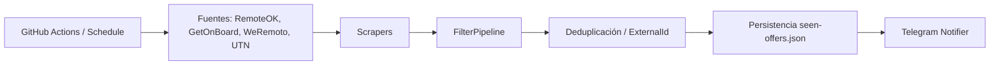

# JobScraperBot


JobScraperBot es un pipeline ETL automatizado y resiliente para detectar oportunidades laborales de tecnología, normalizarlas y entregarlas en un resumen limpio por Telegram.

## Arquitectura



La solución está organizada por capas:

- `JobScraperBot.Core`: interfaces, modelos de dominio y contratos.
- `JobScraperBot.Scrapers`: extracción por sitio con lógica aislada por fuente.
- `JobScraperBot.Filters`: validación de keywords, seniority y remote detection.
- `JobScraperBot.Infrastructure`: almacenamiento local, notificaciones y resiliencia.
- `JobScraperBot.Orchestration`: orquestación, concurrencia y ejecución del ciclo completo.

## Aspectos Ingenieriles

### Idempotencia & Integridad de datos

Se utilizan IDs deterministas para evitar duplicados y mantener consistencia en la deduplicación. La misma oferta siempre intenta producir el mismo `ExternalId`, incluso si el sitio o la respuesta cambian levemente.

### Resiliencia & Tolerancia al fallo

La infraestructura de scraping distingue errores transitorios de permanentes. Para HTTP `429` y `5xx` se hace retry con backoff exponencial y respetando `Retry-After` cuando lo informa la API; para `404`, JSON inválido y selectores rotos no se reintenta.

### Arquitectura limpia

El proyecto usa interfaces como `IJobScraper` y un pipeline de filtros para desacoplar nuevos sitios y reglas de negocio. La lógica de cada fuente vive en su scraper y el core no conoce detalles de HTML o JSON.

## Stack tecnológico

- C# / .NET 8
- xUnit para tests
- AngleSharp / HtmlAgilityPack para parsing
- Polly para resiliencia
- Telegram.Bot para notificaciones
- GitHub Actions para ejecución automatizada

## Como utilizar

1. Clonar el repositorio:

```bash
git clone https://github.com/Agustin-Garcia-Pais-Argentina/JobScraperBot.git
cd JobScraperBot
```

2. Configurar variables de entorno:

```powershell
$env:TELEGRAM_BOT_TOKEN="TU_TOKEN_AQUI"
$env:TELEGRAM_CHAT_ID="TU_CHAT_ID_AQUI"
```

3. Ejecutar la app:

```bash
dotnet run --project src/JobScraperBot.App
```

4. Configurar `profile.json` con keywords, exclusiones y ubicaciones objetivo.

```json
{
  "Keywords": ["C#", ".NET", "Vue", "Python", "SQL"],
  "ExcludedKeywords": ["WordPress", "PHP", "Call Center", "AI Supermarket"],
  "SeniorityExcludeTerms": ["senior", "ssr", "lead", "manager", "principal"],
  "TargetLocations": ["Santa Fe", "Argentina", "Remote"]
}
```

## Roadmap

La hoja de ruta del proyecto vive en [ToDo.md](./ToDo.md).
